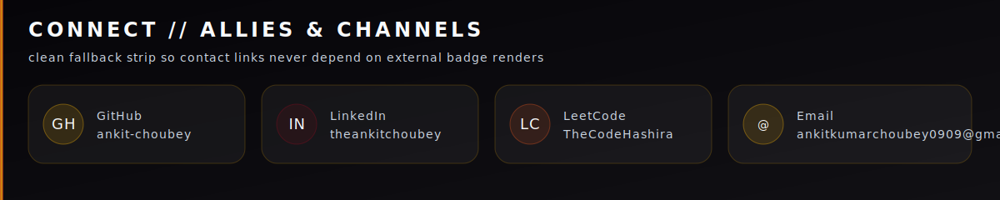

<div align="center">

<!-- ═══════════════════════════════════════════════════════════════════ HERO ══ -->


<br/>

<table>
<tr>
<td align="center"><b>Degree</b><br/>B.Tech CSE · SRM University AP · 3rd Year</td>
<td align="center"><b>Wins</b><br/>5× competition winner · ~$2,304 prize value</td>
<td align="center"><b>Focus</b><br/>AI/ML internships · research · agentic systems</td>
<td align="center"><b>Identity</b><br/>CodeHashiraX · Ankit Choubey</td>
</tr>
</table>

<br/>



</div>


<!-- ══════════════════════════════════════════════════════════ BATTLE RECORD ══ -->
## `// battle_record`

<div align="center">



<table>
<tr>
<th>Metric</th>
<th>Value</th>
<th>Meaning</th>
</tr>
<tr>
<td>Research projects</td>
<td>2</td>
<td>Current focus on applied AI and governance</td>
</tr>
<tr>
<td>Status</td>
<td>Active build</td>
<td>Shipping and iterating in public</td>
</tr>
</table>

</div>


<!-- ═══════════════════════════════════════════════════════════════════ ABOUT ══ -->
## `// about`

I build intelligent systems that reason, collaborate and solve real-world problems. My work focuses on Agentic AI, LLM Engineering, Retrieval-Augmented Generation and backend infrastructure, transforming research ideas into production-ready systems. Alongside engineering, I actively compete in national hackathons, contribute to AI research and build scalable software for real-world impact.

```bash
$ cat /etc/ignis/identity

NAME        =  Ankit Choubey
ROLE        =  AI/ML Engineer  |  Agentic AI & LLM Systems
INSTITUTION =  SRM University AP  |  B.Tech CSE  |  3rd Year
FOCUS       =  Multi-Agent Orchestration  |  RAG  |  RL Environments
RESEARCH    =  AI Governance  |  Explainability  |  Healthcare Speech AI
LOCATION    =  Andhra Pradesh, India
HANDLE      =  CodeHashiraX
```


<!-- ══════════════════════════════════════════════════════════ CURRENT MISSION ══ -->
## `// current_mission`

```yaml
building:
  - Sharingan              # next-gen agentic system
  - Agentic AI Systems     # multi-agent reasoning & orchestration
  - Healthcare Speech AI   # multilingual transcription for Indian healthcare

learning:
  - Reinforcement Learning
  - AI Infrastructure
  - Multi-Agent Systems

exploring:
  - AI Governance
  - Autonomous Reasoning

open_to:
  - AI/ML Internships
  - Research Collaboration
  - Open Source
```


<!-- ═══════════════════════════════════════════════════════ FLAGSHIP PROJECTS ══ -->
## `// flagship_projects`

<details open>
<summary><b>[ 01 ] &nbsp; Aegis-Forge &nbsp;—&nbsp; Multi-Agent AI Orchestration Platform</b></summary>

<br/>

> Multi-Agent AI orchestration platform for autonomous reasoning and real-time collaboration.

**Problem:** Most AI assistants reason independently and lack coordinated decision-making.

**Solution:** Designed a modular multi-agent platform where specialized agents collaborate through orchestration, planning, memory and voice interfaces.

| Dimension | Detail |
| :-- | :-- |
| **Stack** | Python · FastAPI · LangChain · LangGraph · Groq · Deepgram · LiveKit · Docker |
| **Architecture** | Queue-driven orchestration across specialised agents with handoff protocols |
| **Voice Pipeline** | Real-time voice + async reasoning pipeline with sub-second agent routing |
| **Impact** | 🥈 National Hackathon Runner-up · Zenith 2026 · $1,500 prize |

<br/>
</details>

<details>
<summary><b>[ 02 ] &nbsp; TriNetra &nbsp;—&nbsp; Explainable AI Credit Intelligence Platform</b></summary>

<br/>

> Explainable AI Credit Intelligence Platform — every financial decision is interpretable, not a black box.

**Problem:** Financial AI often behaves like a black box, obscuring decision rationale.

**Solution:** Built an explainable credit intelligence platform using interpretable ML and explainability techniques.

| Dimension | Detail |
| :-- | :-- |
| **Stack** | Python · FastAPI · XGBoost · LightGBM · SHAP · LIME · Redis · Supabase |
| **Explainability** | SHAP + LIME overlays on every scoring decision |
| **Performance** | Redis caching + async scoring pipeline |
| **Impact** | 🏅 Hack for Green Top 25 · Microsoft Office Visit |

<br/>
</details>

<details>
<summary><b>[ 03 ] &nbsp; DharmaShield-Env &nbsp;—&nbsp; RL Environment for AI Governance</b></summary>

<br/>

> Reinforcement Learning environment for AI governance and policy compliance research.

**Problem:** AI governance lacks reproducible benchmark environments for measuring safe behavior.

**Solution:** Created an RL environment with configurable governance policies and reward structures for evaluating safe AI behavior.

| Dimension | Detail |
| :-- | :-- |
| **Stack** | Python · Gymnasium · FastAPI · LangChain · Hugging Face · Docker |
| **Design** | Multi-policy benchmark with configurable governance rule sets |
| **Research** | Bridges AI governance theory → measurable RL training signal |
| **Impact** | Research-focused project demonstrating AI safety evaluation concepts |

<br/>
</details>

<details>
<summary><b>[ 04 ] &nbsp; SurakshaMesh &nbsp;—&nbsp; Industrial Worker Safety Platform</b></summary>

<br/>

> Industrial worker safety platform using intelligent hazard prediction and mesh networking.

**Problem:** Industrial hazards are detected too late — reactively rather than predictively.

**Solution:** Designed an AI-assisted worker safety platform with IoT simulation, hazard scoring and predictive monitoring.

| Dimension | Detail |
| :-- | :-- |
| **Stack** | Python · Node.js · React · MongoDB · BLE · LoRa |
| **Network** | Distributed mesh across simulated industrial floor nodes |
| **Monitoring** | Real-time hazard scoring with predictive alert routing |
| **Impact** | 🏆 Winner · HackBIOS 2K25 · $564 prize |

<br/>
</details>

<details>
<summary><b>[ 05 ] &nbsp; EDITH &nbsp;—&nbsp; AI Workflow Assistant for Autonomous Reasoning</b></summary>

<br/>

> AI workflow assistant for autonomous reasoning — orchestrating tools, context, and decision-making.

**Problem:** Users repeatedly switch between disconnected AI tools with no coherent reasoning layer.

**Solution:** Designed an intelligent modular assistant capable of orchestrating AI workflows through structured reasoning.

| Dimension | Detail |
| :-- | :-- |
| **Stack** | Python · FastAPI · LangGraph · LLMs · RAG |
| **Design** | Modular reasoning chains with memory and tool-use |
| **Orchestration** | Structured workflow execution across heterogeneous AI components |
| **Impact** | 🏆 Winner · TechTatva · ₹10,000 prize |

<br/>
</details>

<details>
<summary><b>[ 06 ] &nbsp; ExportEase &nbsp;—&nbsp; AI-Assisted Export Compliance Platform</b></summary>

<br/>

> AI-assisted export compliance platform — making cross-border documentation fast and accurate.

**Problem:** Export documentation and compliance are slow, fragmented and error-prone.

**Solution:** Built an AI system simplifying export documentation and compliance verification.

| Dimension | Detail |
| :-- | :-- |
| **Stack** | Python · React · FastAPI · PostgreSQL |
| **Processing** | Single-pass compliance check + document generation |
| **Coverage** | 21 product categories · bulk CSV processing · QR-coded compliance PDFs |
| **Impact** | 🏅 Top 25 · IIT Bombay LogiTHON · IIT Bombay Visit |

<br/>
</details>


<!-- ════════════════════════════════════════════════════════════════ TECH STACK ══ -->
## `// tech_stack`

<div align="center">

<table>
<tr>
<td>🧠 <b>AI</b><br/>LangChain · LangGraph · PyTorch · Scikit-learn · Hugging Face · RAG · LLMs</td>
<td>⚙️ <b>Backend</b><br/>FastAPI · REST APIs · WebSockets · Node.js</td>
</tr>
<tr>
<td>💾 <b>Databases</b><br/>MongoDB · Redis · Supabase · PostgreSQL</td>
<td>🛠️ <b>DevOps</b><br/>Docker · Git · Linux · GitHub · VS Code · Postman · Ollama</td>
</tr>
<tr>
<td>⌨️ <b>Languages</b><br/>Python · C++ · JavaScript · SQL</td>
<td>🚀 <b>Signal</b><br/>Agentic AI · backend systems · production-ready tooling</td>
</tr>
</table>

</div>


<!-- ══════════════════════════════════════════════════════════════ EXPERIENCE ══ -->
## `// experience`


<table>
<tr>
<th>Role</th>
<th>Core Work</th>
</tr>
<tr>
<td>Research Intern · SRM University AP</td>
<td>Multilingual healthcare speech transcription, domain-specific RAG, and quality improvements for Indian healthcare contexts.</td>
</tr>
<tr>
<td>Research / Product · Discover Persona</td>
<td>AI product development, backend AI systems, and LLM workflow delivery.</td>
</tr>
</table>


<!-- ═══════════════════════════════════════════════════════════════ RESEARCH ══ -->
## `// research`

| Project | Domain | Status |
| :-- | :-- | :-- |
| **Multilingual Healthcare Speech AI** | Speech transcription · RAG · Indian healthcare NLP | 🔬 Active |
| **DharmaShield-Env** | AI governance · RL benchmarks · policy compliance | 🔬 Active |


<!-- ══════════════════════════════════════════════════════════ GITHUB ANALYTICS ══ -->
## `// github_analytics`

<div align="center">



<br/>


</div>


<!-- ═════════════════════════════════════════════════════════ EARLY INNOVATION ══ -->
## `// early_innovation`

<table>
<tr>
<th>Win</th>
<th>Event</th>
<th>Notes</th>
</tr>
<tr>
<td>Inspire Award</td>
<td>CBSE National Science Exhibition</td>
<td>₹10,000 prize · national recognition</td>
</tr>
<tr>
<td>National Finalist × 2</td>
<td>Ideate for India</td>
<td>Early-stage innovation validation</td>
</tr>
<tr>
<td>Regional Finalist</td>
<td>Web3Conf</td>
<td>Competitive finalist placement</td>
</tr>
<tr>
<td>Top 100 Teams</td>
<td>Web3Conf</td>
<td>Shortlisted from a large national pool</td>
</tr>
</table>


<!-- ══════════════════════════════════════════════════════════ CERTIFICATIONS ══ -->
## `// certifications`

<table>
<tr>
<th>Certification</th>
<th>Issuer</th>
<th>Status</th>
</tr>
<tr>
<td>MongoDB Certified Associate Developer</td>
<td>MongoDB, Inc.</td>
<td>Completed</td>
</tr>
</table>


<!-- ════════════════════════════════════════════════════════════════ CONNECT ══ -->
## `// connect`

<div align="center">


<br/>

<a href="https://github.com/ankit-choubey">GitHub</a> ·
<a href="https://www.linkedin.com/in/theankitchoubey">LinkedIn</a> ·
<a href="https://leetcode.com/u/TheCodeHashira/">LeetCode</a> ·
<a href="mailto:ankitkumarchoubey0909@gmail.com">Email</a>

<br/><br/>

<sub><i>// Agentic AI &nbsp;·&nbsp; LLM Engineering &nbsp;·&nbsp; Intelligent Systems &nbsp;·&nbsp; Backend Engineering</i></sub>

</div>


